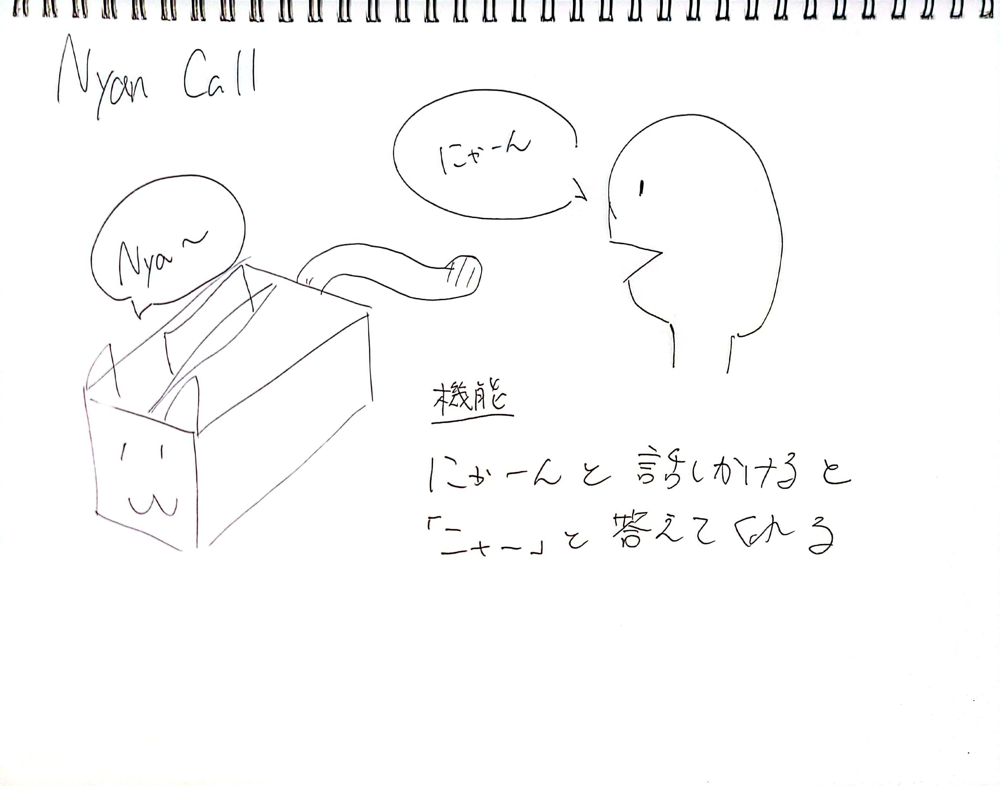

# NyanCall
## このProjectの概要
- よく家でティッシュ箱の場所が行方不明になる
- 猫！と声をかけるとにゃーん！と言って場所を知らせてくれるティッシュ箱を作りたい
## このProjectで得たいこと
- 組み込み系のプログラム（M5Stackのプログラムを組み込み系というのかは謎だが）を久しぶりに書きたい。
- TTSとやらを使ってみたい
- 買って以来ほとんど使ってない３Ｄプリンターでデバイスの筐体設計ができるようになりたい
## スケジュール
- 2月中にプログラムを完成させて、試作筐体まで作れるといいなぁ
##　構想設計
  

## 要件
- NyanCallデバイスはティッシュ箱にくっつけることができる
- NyanCallデバイスを独立した電源を持つ
- 私がにゃーんと話しかけると、NyanCallデバイスがそれを検知し「にゃーん」という声を再生して、ティッシュ箱の場所を教えてくれる
- NyanCallデバイスからの声はいくつかパターンがある

## ステップ
- STEP1: ATOM echoで自分が発したにゃーんという声を拾って検知する
- STEP2: 上記に対してにゃーんという声を再生する
- STEP3: 常ににゃーんという声を拾ったら、にゃーんという声を再生できるか確かめる
- STEP4: ATOM Echoにバッテリーをつなげて、プログラムを作動させた場合、どれくらい電池が持つか実験する
- STEP5: デバイスの筐体を設計する

## 調査
### ATOM Echoで自分が発した声を検知して翻訳する
- esp32_CloudSpeechというライブラリを使うっぽい
- Google speech to textを使う場合、一か月60分以上やるとお金かかるっぽい
https://cloud.google.com/speech-to-text/pricing
詰んだか？

##　参考資料
- robo 8080さんのtweet一覧
https://twitter.com/robo8080/status/1321347490294067200